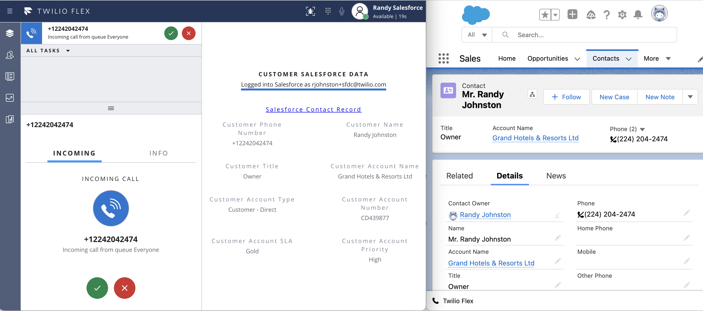
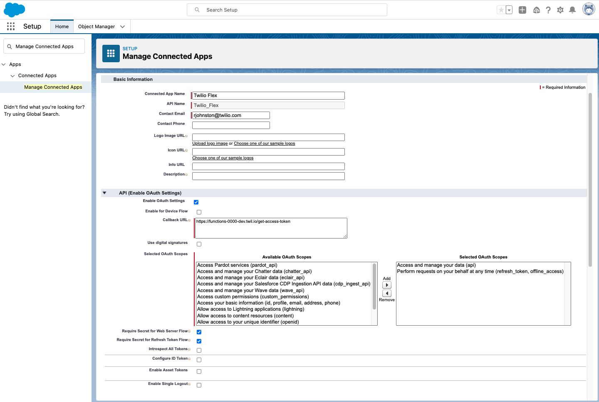

# Flex Plugin for Salesforce CRM Integration

Twilio Flex Plugins allow you to customize the appearance and behavior of [Twilio Flex](https://www.twilio.com/flex). If you want to learn more about the capabilities and how to use the API, check out our [Flex documentation](https://www.twilio.com/docs/flex).

## How it works

This Flex plugin adds a Salesforce CRM data component to the second panel ([AgentDesktopView Panel2](https://assets.flex.twilio.com/docs/releases/flex-ui/1.21.0/Panel2.html)) in the Flex UI. It allows Flex agents to delegate OAuth access to Flex & Functions to query Salesforce Contacts & Accounts for the caller's phone number and displays key fields from the Salesforce Contact and Account record.

This plugin leverages Twilio functions to faciliate the [OAuth authorization code flow](https://help.salesforce.com/articleView?id=sf.remoteaccess_oauth_flows.htm) and query Salesforce for User, Account, and Contact data using OAuth access & refresh tokens stored in a dedicated [Sync Map](https://www.twilio.com/docs/sync/api/map-resource). Once the agent has authenticated to their Salesforce user account, Flex will dynamically query and render the caller's Salesforce fields in the secondary panel in the agent desktop.

## Screenshots




## Pre-requisites

To deploy this plugin, you will need:

- An active Twilio account with Flex provisioned. Refer to the [Flex Quickstart](https://www.twilio.com/docs/flex/tutorials/setup) to create one.
- [SSO](https://www.twilio.com/docs/flex/admin-guide/setup/sso-configuration) configured for your Flex instance. This ensures that the Salesforce and Flex accounts can be linked securely using a common SSO identity provider. Flex users will not be able to link Salesforce unless they are authenticated through SSO and users within the configured Salesforce Org. 
- npm version 5.0.0 or later installed (type `npm -v` in your terminal to check)
- Node.js version 12 or later installed (type `node -v` in your terminal to check)
- [Twilio CLI](https://www.twilio.com/docs/twilio-cli/quickstart#install-twilio-cli) along with the [Flex CLI Plugin](https://www.twilio.com/docs/twilio-cli/plugins#available-plugins) and the [Serverless Plugin](https://www.twilio.com/docs/twilio-cli/plugins#available-plugins). Run the following commands to install them:
  ```bash
  # Install the Twilio CLI
  npm install twilio-cli -g
  # Install the Serverless and Flex as Plugins
  twilio plugins:install @twilio-labs/plugin-serverless
  twilio plugins:install @twilio-labs/plugin-flex
  ```
- [Salesforce Developer](https://developer.salesforce.com/signup) or Sandbox Org. with System Administrator access

## Salesforce Connected App

Create a [Salesforce Connected App](https://help.salesforce.com/articleView?id=sf.connected_app_create_basics.htm) under Salesforce Setup > App Maanger > New Connected App with at least `Access and manage your data (api)` OAuth scope. The Callback URL will be configured later after the Twilio Function has been deployed. 



## Sync setup

1. Create a new [Sync Service](https://www.twilio.com/docs/sync/api/service#create-a-service-resource). Record the Sync Service SID. **Note**: Do **NOT** use the Default Flex Sync Service. Ensure that "ACL enabled" is true: 
```bash
twilio api:sync:v1:services:create --friendly-name Salesforce --acl-enabled
```


2. Create a new [Sync Map](https://www.twilio.com/docs/sync/api/map-resource). Record the Sync Map SID:
```bash
twilio api:sync:v1:services:maps:create --service-sid ISXXXXXXXXXXXXXXXXXXXXXXXXXXXXXXXX --unique-name "Salesforce tokens"
```

## Functions & Flex Plugin Setup

1. Clone this repo:

  ```bash
  git clone https://github.com/randyjohnston/plugin-salesforce-crm-integration
  ```

2. Install the dependencies

  ```bash
  # Install the dependencies of the Flex Plugin
  npm install
  
  # Install the dependencies of the Twilio Functions
  cd functions
  npm install
  ```

3. Copy the `.env.example` file in the `functions/` directory:

  ```bash
  cp functions/.env.example functions/.env
  ```

4. Edit `.env`:

  ```bash
    ACCOUNT_SID= Found at https://www.twilio.com/console
    AUTH_TOKEN= Found at https://www.twilio.com/console 
    SYNC_SERVICE_SID= Created above during Sync Setup
    SYNC_MAP_SID= Created above during Sync Setup
    SFDC_INSTANCE_URL= Your Salesforce instance URL, e.g. https://abc-dev-ed.my.salesforce.com
    SFDC_ORG_ID= Your 18-character Salesforce Organization ID (e.g. 00A1a000001AaAaAAA)
    SFDC_CLIENT_ID= Your Salesforce Connected App OAuth Client ID
    SFDC_CLIENT_SECRET= Your Salesforce Connected App OAuth Client Secret
  ```

5. Copy the `.env.example` file in the root directory:

  ```bash
  cp .env.example .env
  ```

6. In a future step, once you have deployed your code, you'll get a domain for your Twilio Functions. Copy this and set the `REACT_APP_SERVICE_BASE_URL` in the `.env` file.

7. Copy the `public/appConfig.example.js` over:

  ```bash
  cp public/appConfig.example.js public/appConfig.js
  ```

## Development

In order to develop locally, you can use the Webpack Dev Server by running (from the root plugin directory):

  ```bash
  # Start Flex Plugins
  twilio flex:plugins:start
  
  # Start Twilio Functions
  cd functions && npm run start 
  ```

This will automatically start up the Webpack Dev Server and open the browser for you. Your app will run on `http://localhost:3000`. If you want to change that you can do this by setting the `PORT` environment variable:

When you make changes to your code, the browser window will be automatically refreshed.

## Deploy

When you are ready to deploy your plugin, first deploy your Twilio Functions:

```bash
twilio serverless:deploy
```

*Note: Record the function URL with path ending in `/get-access-token`, as this will be configured in Salesforce as the OAuth Callback URL. 

Then deploy your Flex Plugins

```bash
twilio flex:plugins:deploy --major --changelog "Notes for this version" --description "Functionality of the plugin"
```

For more details on deploying your plugin, refer to the [deploying your plugin guide](https://www.twilio.com/docs/flex/plugins#deploying-your-plugin).


## Configure Salesforce Callback URL

Once your Twilio Functions have deployed, configure the Salesforce Callback URL under Salesforce Setup > App Maanger > New Connected App. This URL will be in the format of `https://functions-0000-dev.twil.io/get-access-token`.
